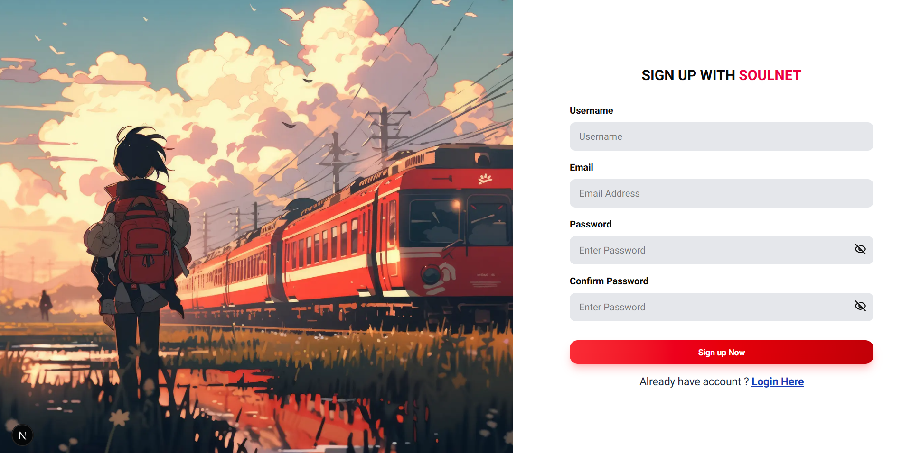
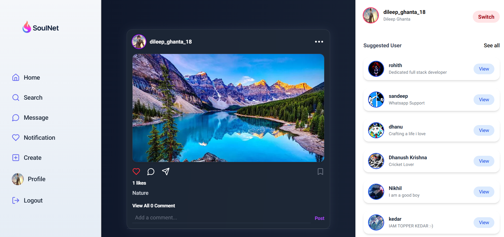

<h1 align="center">SoulNet 🤝</h1>

## Overview
This social media app, SoulNet, built with Next.js on the frontend and a Node.js/Express backend.

### SignUp Page
 

### Login Page
 

### Home Page
 

## Setup Steps

- Clone the Repository

```
git clone https://github.com/DileepGhanta/SoulNet.git
```

- Start backend
```
cd backend
nodemon server.js
```

- Start frontend
```
cd frontend
npm run dev
```

