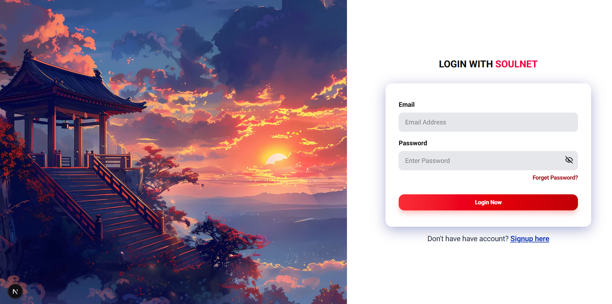

<h1 align="center">SoulNet</h1>

## Overview
SoulNet is a modern, full-stack social media application developed using the MERN stack (MongoDB, Express.js, React.js/Next.js, and Node.js) to provide users with a secure and interactive platform for digital communication. The application features user authentication (JWT-based), profile management, multimedia post creation, real-time likes/comments, follow/unfollow functionality, and personalized feeds, all wrapped in a responsive UI optimized for both desktop and mobile devices. Designed to address privacy concerns and algorithmic biases of existing platforms, SoulNet emphasizes scalability, data security (HTTPS, hashed passwords), and user-centric design. Future enhancements include real-time messaging, stories, and AI-driven recommendations, positioning it as a versatile foundation for community building and content sharing.

### SignUp Page
 

### Login Page
 

### Home Page
 

## Setup Steps

- Clone the Repository

```bash
git clone https://github.com/DileepGhanta/SoulNet.git
```

- Start backend

Navigate to the `backend` directory and start the backend server using `nodemon`:

```bash
cd backend
nodemon server.js
```

- Start frontend

Navigate to the `frontend` directory and start the frontend development server:

```bash
cd frontend
npm run dev
```

